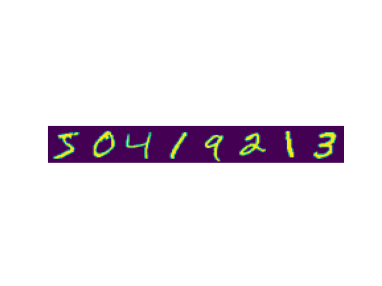

### Convolutional Neural network Exercise

#### Task 1 - Find Waldo
In this first task use cross-correlation to find Waldo in the image below:

[ Image source: https://rare-gallery.com ]

Recall that cross-correlation, which the machine learning world often refers to as convolution as defined as:

$$ S(i,j) = (\mathbf{K}*\mathbf{I}) = \sum_m^M \sum_n^N \mathbf{I}(i+m, j+n)\mathbf{K}(m,n). $$

For an image matrix I and a kernel matrix K of shape (M,N). To find waldo use the waldo-kernel below:

Navigate to the `src/custom_conv.py` module and implement convolution following the equation above.
If your code passes the unit test but is too slow to find waldo feel free to use `jax.scipy.signal.correlate2d` .

#### Task 2 - MNIST - Digit recognition

Open `src/mnist.py` and implement MNIST digit recognition with `CNN` in `jax` use `flax` to help you. *Reuse* your code from yesterday.
Reuse yesterday's `Net` class, add convolutional layers and pooling.
`flax.linen.Conv` and `flax.linen.max_pool` will help you.
